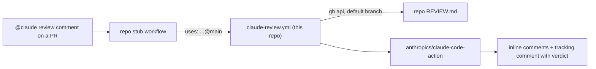

# claude-review

Shared `@claude review` workflow for my repositories. The action version,
model, effort, trigger gate, permissions, tool allowlist and prompt live in one
file, [`.github/workflows/claude-review.yml`](.github/workflows/claude-review.yml).
Each repository keeps a short trigger stub and its own `REVIEW.md`.



## Use it in a repository

1. Install the Claude GitHub App on the repository and store
   `CLAUDE_CODE_OAUTH_TOKEN` as a repository secret or in an environment.
2. Add `REVIEW.md` at the repository root: what reviewers report, what they
   skip, the repository's invariants and its verification gates. People,
   Claude, Codex and other agents all read this file, so it names no tools.
3. Add the stub, for example `.github/workflows/claude-code-review.yml`:

```yaml
name: Claude Code Review

# "@claude review" on a PR runs the shared workflow in brandonwie/claude-review.
# The review standard is REVIEW.md at the repository root.

on:
  issue_comment:
    types: [created]

jobs:
  review:
    uses: brandonwie/claude-review/.github/workflows/claude-review.yml@main
    permissions:
      contents: read
      pull-requests: write
      issues: read
      id-token: write
      actions: read
    secrets:
      CLAUDE_CODE_OAUTH_TOKEN: ${{ secrets.CLAUDE_CODE_OAUTH_TOKEN }}
    # with:
    #   environment: brandonwie  # when the token is an environment secret
```

`issue_comment` runs the stub from the default branch, so the stub and
`REVIEW.md` take effect once they are on that branch.

## Inputs

| Input           | Default      | Meaning                                                                   |
| --------------- | ------------ | ------------------------------------------------------------------------- |
| `review_file`   | `REVIEW.md`  | Review standard, repository-relative, read from the default branch        |
| `environment`   | empty        | Environment holding `CLAUDE_CODE_OAUTH_TOKEN`; empty uses the repo secret |
| `allowed_users` | `brandonwie` | Comma-separated logins whose `@claude review` comment starts a review     |

## Change the shared setup

Edit `claude-review.yml` on `main`. Every stub calls `@main`, so the next
review in every repository uses the change. Pin a new
`anthropics/claude-code-action` release by its commit SHA, and change the
model or effort in `claude_args`.

## Constraints

- The repository is public. A caller owned by another account or organization
  can call a reusable workflow only from a public repository, and only when its
  Actions policy allows public reusable workflows.
- A called job can only narrow `GITHUB_TOKEN` permissions, so each stub grants
  the set listed above. `id-token: write` lets the action mint its GitHub App
  token.
- An environment secret reaches the review only through the `environment`
  input; a stub job cannot set `environment` itself.
- Keep the `secrets:` line even when the token is an environment secret. A
  probe on 2026-10-09 showed the called job reads the environment secret when
  the stub passes `CLAUDE_CODE_OAUTH_TOKEN`, and an empty value when it does
  not. An empty `environment` input runs the job with no environment.
