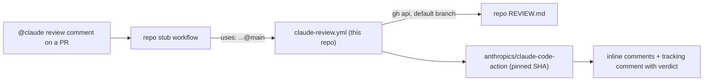

# claude-review

Shared Claude GitHub Actions workflows for my repositories. One commit here
changes the action version, model, trigger, token routing and prompt for every
repository that calls them. Each repository keeps a short stub and its own
`REVIEW.md`.

| Workflow                                                              | Runs when                                                     |
| --------------------------------------------------------------------- | ------------------------------------------------------------- |
| [`claude-review.yml`](.github/workflows/claude-review.yml)            | `brandonwie` comments `@claude review` on a pull request      |
| [`claude-assistant.yml`](.github/workflows/claude-assistant.yml)      | `brandonwie` mentions `@claude` anywhere else (optional stub) |
| [`pin-check.yml`](.github/workflows/pin-check.yml) (this repo only)   | every push; fails when the two workflows pin different SHAs   |
| [`sync-token.yml`](.github/workflows/sync-token.yml) (this repo only) | manual; copies the token here into every caller               |



## Token routing

Every stub is identical; the shared workflows pick the token from the
repository owner and the commenter.

- **Personal repositories** (owner `brandonwie`): only `brandonwie`'s
  `@claude review` runs, with the repository secret.
- **Work repositories** (any other owner): each person reviews with their own
  token, in an environment named after their GitHub login (`brandonwie` for
  me). A comment from someone without that environment gets a PR comment
  explaining the setup and no review, so nobody's comment ever spends another
  person's token. The general `@claude` assistant stays `brandonwie`-only.

To let a teammate review in a work repository, a repository admin creates the
environment named after the teammate's login, limited to `main`, and the
teammate's token goes into it:

```bash
R=<owner>/<repo> L=<teammate-login>
echo '{"deployment_branch_policy":{"protected_branches":false,"custom_branch_policies":true}}' \
  | gh api -X PUT repos/$R/environments/$L --input -
gh api -X POST repos/$R/environments/$L/deployment-branch-policies -f name=main -f type=branch
gh secret set CLAUDE_CODE_OAUTH_TOKEN --env $L --repo $R   # the teammate pastes their token
```

Environment secrets need repository admin rights to set, and nobody can read
them back. Anyone who can push a workflow to `main` can use any environment
there, so protect `main` with required reviews.

## One token, copied everywhere

GitHub has no account-level Actions secret, and a called workflow cannot read
secrets of the repository that hosts it (a 2026-10-09 probe read an empty
value, with and without `secrets: inherit`). So each caller needs its own copy,
and this repository keeps the one copy you edit:

1. Put the token (from `claude setup-token`) in this repository's
   `CLAUDE_CODE_OAUTH_TOKEN` secret, for example
   `op read 'op://<vault>/<item>/credential' | gh secret set CLAUDE_CODE_OAUTH_TOKEN --repo brandonwie/claude-review`.
2. Run **Sync token** (`gh workflow run sync-token.yml --repo brandonwie/claude-review`).
   [`scripts/sync-token.sh`](scripts/sync-token.sh) finds every repository of
   `brandonwie` and `playtag-dev` whose workflows use this repository, then
   writes the token to its repository secret (personal) or `brandonwie`
   environment (work). The environment must exist. Logs show counts only.

The job authenticates with `SYNC_GH_TOKEN`, a personal access token that can
write Actions secrets in every caller (classic token with the `repo` scope, so
one token covers both owners). Locally, the same script works with your `gh`
login: `op read '…' | scripts/sync-token.sh`, or `--dry-run` to list callers.

## Use it in a repository

1. Install the Claude GitHub App and store `CLAUDE_CODE_OAUTH_TOKEN` (see
   [Token routing](#token-routing)).
2. Add `REVIEW.md` at the repository root: what reviewers report, what they
   skip, the repository's invariants and its verification gates. It names no
   tools, because every reviewer reads it.
3. Add `.github/workflows/claude-code-review.yml`:

```yaml
name: Claude Code Review

# "@claude review" on a PR runs the shared workflow in brandonwie/claude-review.
# The review standard is REVIEW.md at the repository root.

on:
  issue_comment:
    types: [created]

jobs:
  claude-review:
    uses: brandonwie/claude-review/.github/workflows/claude-review.yml@main
    permissions:
      contents: read
      pull-requests: write
      issues: read
      id-token: write
      actions: read
    secrets:
      CLAUDE_CODE_OAUTH_TOKEN: ${{ secrets.CLAUDE_CODE_OAUTH_TOKEN }}
```

4. Optional, for the general assistant, add `.github/workflows/claude.yml`:

```yaml
name: Claude Code

on:
  issue_comment:
    types: [created]
  pull_request_review_comment:
    types: [created]
  issues:
    types: [opened, assigned]
  pull_request_review:
    types: [submitted]

jobs:
  claude:
    uses: brandonwie/claude-review/.github/workflows/claude-assistant.yml@main
    permissions:
      contents: write
      pull-requests: write
      issues: write
      id-token: write
      actions: read
    secrets:
      CLAUDE_CODE_OAUTH_TOKEN: ${{ secrets.CLAUDE_CODE_OAUTH_TOKEN }}
```

`issue_comment` runs the stub from the default branch, so a stub and
`REVIEW.md` take effect once they are on that branch.

## Other reviewers and `REVIEW.md`

| Reviewer                     | How it gets `REVIEW.md`                                                      |
| ---------------------------- | ---------------------------------------------------------------------------- |
| Claude (this workflow)       | the prompt reads it from the default branch                                  |
| Claude Code Review (managed) | reads root `REVIEW.md` natively                                              |
| Copilot code review          | reads `REVIEW.md` natively (from the PR head branch)                         |
| Devin Review                 | reads `**/REVIEW.md` natively                                                |
| CodeRabbit                   | `.coderabbit.yaml`: `inheritance: true` and `code_guidelines.filePatterns`   |
| Codex (`@codex review`)      | a `## Code Review Rules` section in a real root `AGENTS.md` that points here |

Codex has no setting for the review file name. Where a repository keeps a
fuller local Codex profile, put it in a git-ignored `AGENTS.override.md`: local
Codex reads that file before `AGENTS.md`, and hosted review sees only the
committed pointer. Company repositories that forbid agent files get no
`AGENTS.md` at all.

Sources:
[Claude Code Review](https://code.claude.com/docs/en/code-review),
[Copilot code review](https://docs.github.com/en/copilot/how-tos/use-copilot-agents/request-a-code-review/use-code-review),
[Devin Review](https://docs.devin.ai/work-with-devin/devin-review),
[CodeRabbit code guidelines](https://docs.coderabbit.ai/knowledge-base/code-guidelines),
[CodeRabbit configuration](https://docs.coderabbit.ai/reference/configuration),
[Codex AGENTS.md](https://developers.openai.com/codex/guides/agents-md).

## Change the shared setup

Edit the workflows on `main`. Every stub calls `@main`, so the next run in
every repository uses the change. To bump `anthropics/claude-code-action`,
pin the new release's commit SHA in both workflows in one commit;
`scripts/check-pins.sh` (run by `pin-check.yml`) fails otherwise. Change the
review model or effort in `claude-review.yml`'s `claude_args`.

## Constraints

- The repository is public. A caller owned by another account or organization
  can call a reusable workflow only from a public repository, and only when its
  Actions policy allows public reusable workflows.
- A called job can only narrow `GITHUB_TOKEN` permissions, so each stub grants
  the set shown above. `id-token: write` lets the action mint its GitHub App
  token.
- Keep the `secrets:` line in every stub. A probe on 2026-10-09 showed the
  called job reads the environment secret only when the stub passes
  `CLAUDE_CODE_OAUTH_TOKEN`, and an empty value when it does not. An empty
  environment name runs the job with no environment.
