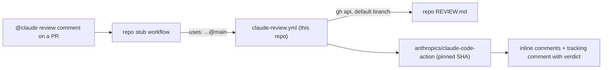

# claude-review

Shared Claude GitHub Actions workflows for my repositories. One commit here
changes the action version, model, trigger, token routing and prompt for every
repository that calls them. Each repository keeps a short stub and its own
`REVIEW.md`.

| Workflow                                                            | Runs when                                                     |
| ------------------------------------------------------------------- | ------------------------------------------------------------- |
| [`claude-review.yml`](.github/workflows/claude-review.yml)          | `brandonwie` comments `@claude review` on a pull request      |
| [`claude-assistant.yml`](.github/workflows/claude-assistant.yml)    | `brandonwie` mentions `@claude` anywhere else (optional stub) |
| [`pin-check.yml`](.github/workflows/pin-check.yml) (this repo only) | every push; fails when the two workflows pin different SHAs   |



## Token routing

Work repositories (owner other than `brandonwie`) keep
`CLAUDE_CODE_OAUTH_TOKEN` in an environment named `brandonwie`. Personal
repositories keep it as a repository secret. The shared workflows pick the
environment from the repository owner, so every stub is identical.

## Use it in a repository

1. Install the Claude GitHub App and store `CLAUDE_CODE_OAUTH_TOKEN` (see
   [Token routing](#token-routing)).
2. Add `REVIEW.md` at the repository root: what reviewers report, what they
   skip, the repository's invariants and its verification gates. It names no
   tools, because every reviewer reads it.
3. Add `.github/workflows/claude-code-review.yml`:

```yaml
name: Claude Code Review

# "@claude review" on a PR runs the shared workflow in brandonwie/claude-review.
# The review standard is REVIEW.md at the repository root.

on:
  issue_comment:
    types: [created]

jobs:
  claude-review:
    uses: brandonwie/claude-review/.github/workflows/claude-review.yml@main
    permissions:
      contents: read
      pull-requests: write
      issues: read
      id-token: write
      actions: read
    secrets:
      CLAUDE_CODE_OAUTH_TOKEN: ${{ secrets.CLAUDE_CODE_OAUTH_TOKEN }}
```

4. Optional, for the general assistant, add `.github/workflows/claude.yml`:

```yaml
name: Claude Code

on:
  issue_comment:
    types: [created]
  pull_request_review_comment:
    types: [created]
  issues:
    types: [opened, assigned]
  pull_request_review:
    types: [submitted]

jobs:
  claude:
    uses: brandonwie/claude-review/.github/workflows/claude-assistant.yml@main
    permissions:
      contents: write
      pull-requests: write
      issues: write
      id-token: write
      actions: read
    secrets:
      CLAUDE_CODE_OAUTH_TOKEN: ${{ secrets.CLAUDE_CODE_OAUTH_TOKEN }}
```

`issue_comment` runs the stub from the default branch, so a stub and
`REVIEW.md` take effect once they are on that branch.

## Other reviewers and `REVIEW.md`

| Reviewer                     | How it gets `REVIEW.md`                                                      |
| ---------------------------- | ---------------------------------------------------------------------------- |
| Claude (this workflow)       | the prompt reads it from the default branch                                  |
| Claude Code Review (managed) | reads root `REVIEW.md` natively                                              |
| Copilot code review          | reads `REVIEW.md` natively (from the PR head branch)                         |
| Devin Review                 | reads `**/REVIEW.md` natively                                                |
| CodeRabbit                   | `.coderabbit.yaml`: `inheritance: true` and `code_guidelines.filePatterns`   |
| Codex (`@codex review`)      | a `## Code Review Rules` section in a real root `AGENTS.md` that points here |

Sources:
[Claude Code Review](https://code.claude.com/docs/en/code-review),
[Copilot code review](https://docs.github.com/en/copilot/how-tos/use-copilot-agents/request-a-code-review/use-code-review),
[Devin Review](https://docs.devin.ai/work-with-devin/devin-review),
[CodeRabbit code guidelines](https://docs.coderabbit.ai/knowledge-base/code-guidelines),
[CodeRabbit configuration](https://docs.coderabbit.ai/reference/configuration),
[Codex AGENTS.md](https://developers.openai.com/codex/guides/agents-md).

## Change the shared setup

Edit the workflows on `main`. Every stub calls `@main`, so the next run in
every repository uses the change. To bump `anthropics/claude-code-action`,
pin the new release's commit SHA in both workflows in one commit;
`scripts/check-pins.sh` (run by `pin-check.yml`) fails otherwise. Change the
review model or effort in `claude-review.yml`'s `claude_args`.

## Constraints

- The repository is public. A caller owned by another account or organization
  can call a reusable workflow only from a public repository, and only when its
  Actions policy allows public reusable workflows.
- A called job can only narrow `GITHUB_TOKEN` permissions, so each stub grants
  the set shown above. `id-token: write` lets the action mint its GitHub App
  token.
- Keep the `secrets:` line in every stub. A probe on 2026-10-09 showed the
  called job reads the environment secret only when the stub passes
  `CLAUDE_CODE_OAUTH_TOKEN`, and an empty value when it does not. An empty
  environment name runs the job with no environment.
